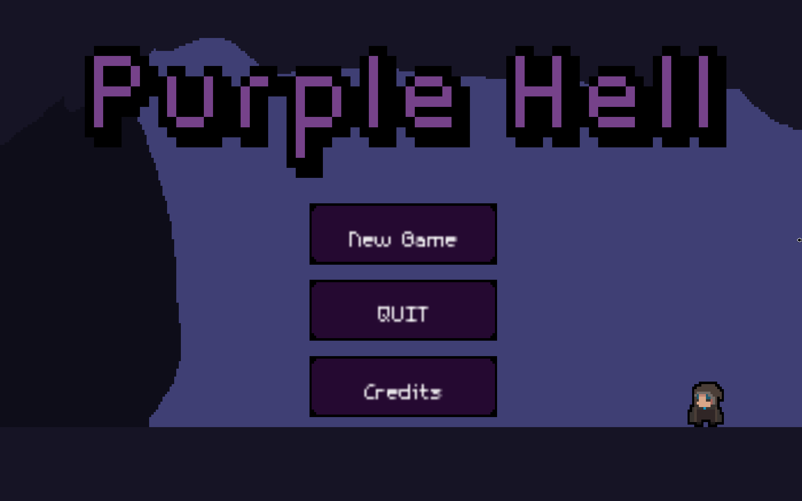
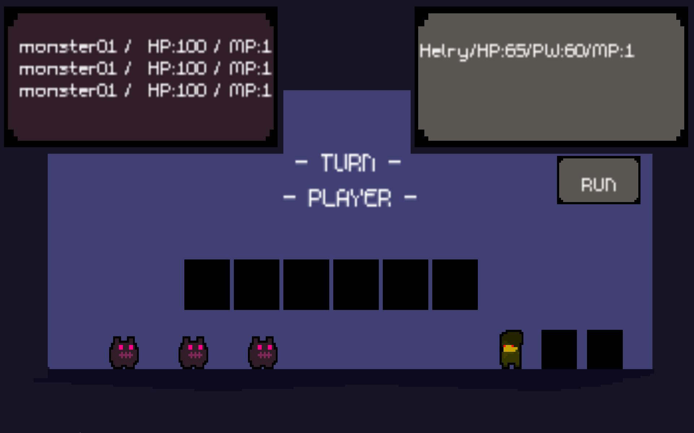

# [PurpleHell](https://github.com/fabvarisco/sfml-purple-hell)



PurpleHell is a turn-based, wave-survival RPG written in **C++17** with **SFML 2.5.1**.
It was built as a college project to exercise data structures (linked lists, stacks, queues).
Your objective is to survive successive waves of enemies for as long as you can.

## Built With

* C/C++ (C++17)
* SFML 2.5.1

## Download

Prebuilt binaries for Linux, macOS and Windows are published on the repository's
[**Releases**](https://github.com/fabvarisco/sfml-purple-hell/releases) page.

## Gameplay



You command a **team of 3 heroes** against an **enemy wave of up to 5 monsters** in
classic turn-based combat. Between battles you return to the hub, where you spend gold
to recruit heroes, buy items and manage your team, then dive back in to face the next,
tougher wave.

### Game Loop

1. **Main Menu** — start a new game or continue a saved one.
2. **Hub (GameScene)** — the central screen. Here you:
   * visit the **Shop** to recruit new heroes and buy items/potions,
   * manage your **roster** (10 hero slots) and your **battle team** (3 heroes),
   * equip items, then head out to fight.
3. **World (WorldScene)** — transition into the current level's encounter.
4. **Battle (BattleScene)** — turn-based combat against the wave:
   * **Player turn:** each of your 3 heroes acts once — normal **Attack**, a job
     **Magic/Special** (once per round), use a **Potion/Item**, or **Run**.
   * **Enemy turn:** each living enemy attacks (with a chance to miss); poison and stun
     status effects resolve here.
   * The round repeats until one side is wiped out.
5. **Win → next level.** Defeating the wave increments the level, awards gold, and sends
   you back to the hub to prepare for a stronger wave. **Lose → game over.**

Progress (team, roster, inventory, gold, level) is saved to plain-text files under
`PurpleHell/res/Player/`, so the run persists between sessions.

### Combat details

* **Normal attack:** deals `power` damage to one enemy.
* **Special/Magic:** each hero has 1 of 3 job abilities (rolled when recruited), usable
  **once per round**. Effects include heavy single-target hits, AOE, poison, stun,
  life-drain, gold-steal and instant-kill.
* **Status effects:** *Poison* (5 dmg/turn for 3 turns) and *Stun* (enemy skips its turn).

See **[ABILITIES.md](./ABILITIES.md)** for the full per-job ability reference.

### Jobs

There are **6 hero jobs**, each with its own set of 3 specials:

| Job | Flavor |
|---|---|
| **Mage** | Elemental magic — Thunder (AOE), Fireball (burn), Waterfall (heavy hit) |
| **Rogue** | Trickster — Steal (gold), Poison Dagger, Kick (stun) |
| **Knight** | Bruiser — Double Slash, Rage (x4), Kick (stun) |
| **Demonhunter** | Aggressor — Scars Slash (x3), Drain Blood (lifesteal), Punch |
| **Warlock** | Dark caster — Drain Life (lifesteal), Death Touch (instant kill), Curse |
| **Archer** | Ranged — Double Slash, Poison Dagger, Kick (stun) |

## Architecture

**Scene stack.** `main.cpp` runs `GameManager`, which owns the `sf::RenderWindow`, the
delta-time clock, and a `std::stack<Scene*>`. Each frame only the top scene is
updated/rendered; a scene pops itself with `Scene::endScene()` and pushes new scenes onto
the shared stack:

```
MainMenuScene → GameScene (hub) → WorldScene → BattleScene
```

`Scene` is the abstract base (`updateInput`, `update`, `render`) and provides shared
mouse-tracking and fade-in logic.

### Key classes

| Class | Responsibility |
|---|---|
| `GameManager` | Owns the window, clock and scene stack; the main game loop |
| `Scene` (base) | Abstract scene; `MainMenuScene`, `GameScene`, `WorldScene`, `BattleScene` |
| `Entity` (base) | Anything drawable/stat-bearing: texture, sprite, hp/power/special, `AnimationComponent` |
| `Hero` (`→ Mage`) | Player units (job, specials); derives from `Entity` |
| `Enemy` | Wave monster (name/hp/power); derives from `Entity` |
| `Especial` | Attack/spell visual effect and its damage payload |
| `Buff` / `Debuff` | Combat stat modifiers |
| `Potion` / `Item` | Inventory items and their effects |
| `Player` | The 3-hero battle team, gold and level |
| `Units` | The 10-slot hero roster |
| `AI` | The 5-slot enemy team for a battle (loaded per level from `res/AI/<n>.txt`) |
| `Inventory` / `EquipedItems` / `Shop` | Item management and recruiting |
| `Button` | Reusable UI button |
| `Recursao` | Recursion-based helper (data-structure exercise) |
| `AnimationComponent` | Sprite-sheet animation |

### Persistence

Saves are plain-text files. Player state is read/written at runtime under
`res/Player/*.txt` (Team, Units, Inventory, Info, equiped) and enemy definitions come from
`res/AI/<n>.txt`. Classes with `Arquivo*` methods (Portuguese for "file") do this parsing
with `ifstream`/`getline`. **Running the game mutates these files.**

> Note: identifiers and comments mix English and Portuguese (e.g. `Especial`, `Arquivo`,
> `Recursao`). Follow the existing names when extending those classes.

## Build and Run

Linux (primary for development):

```bash
nix-shell      # from repo root — provides gnumake + sfml_2 (SFML 3 is API-incompatible)
cd PurpleHell
make           # builds ./PurpleHell (g++ -std=c++17 -Wall); objects go to build/
./PurpleHell   # must be run from PurpleHell/ — assets/saves use relative "res/..." paths
make clean     # removes build/ and the PurpleHell binary
```

CI/releases (`.github/workflows/release.yml`) build all three OSes via the root
`CMakeLists.txt`, which fetches and statically links SFML 2.6.2 from source. Pushing a
`v*` tag creates a GitHub Release with the packaged builds.

</content>
</invoke>
